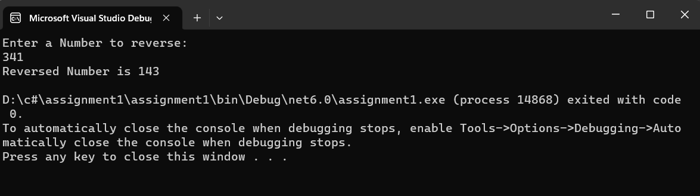

## Recursive-function

## Aim: 
To write a C# program to reverse a number using recursive function.

## Algorithm:
## Step1:
Create a function for reversing.

## Step2:
Get the number from the user.

## Step3:
In the function find reminder of the number and multiply it by 10 and add the reverse number.

## Step4:
Recusively call this function to get the reversed number.

## Step5:
print the reversed number.
## Program:
```
using System;
namespace reverse
{
    class ex
    {
        int rem, rev = 0;
        public int numRev(int num)
        {
            rem = num % 10;
            if (rem == 0)
            {
                return rev;
            }
            else
            {
                rem = num % 10;
                rev = rev * 10 + rem;
                return numRev(num / 10);

            }

        }
        static void Main(string[] args)
        {
            int n;
            Console.WriteLine("Enter a Number to reverse: ");
            n = Convert.ToInt32(Console.ReadLine());

            ex e1 = new ex();
            Console.WriteLine("Reversed Number is " + e1.numRev(n));
        }
    }
}
```
## Output:

## Result:
Thus C# program to reverse a number using recursive function is written and executed sucessfully.